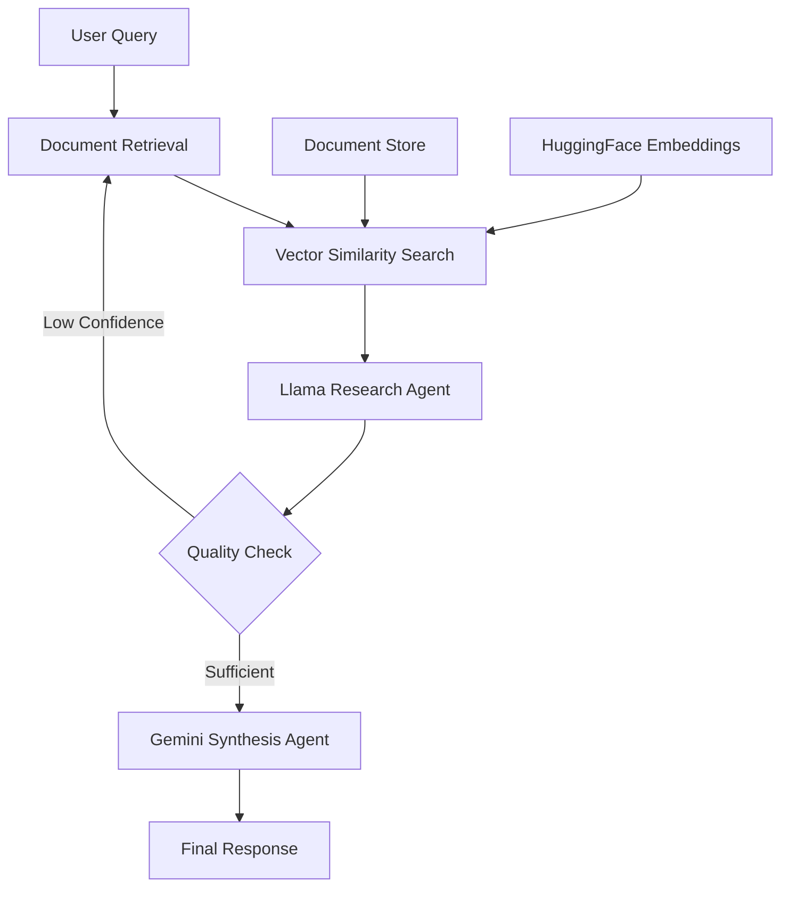

# Multi-Agent RAG Workflow

A sophisticated **Retrieval-Augmented Generation (RAG)** system that combines multiple AI agents to provide intelligent, research-backed responses to user queries. This project demonstrates advanced AI orchestration using LangGraph, vector databases, and multiple language models.

## Features

- **Intelligent Document Retrieval**: Semantic search using HuggingFace embeddings and Chroma vector database
- **Multi-Agent Architecture**: Specialized AI agents for research analysis and synthesis
- **Adaptive Workflow**: Dynamic decision-making with conditional research loops
- **Comprehensive Analytics**: Detailed metadata tracking and performance monitoring
- **Async Processing**: High-performance asynchronous execution
- **🛡Robust Error Handling**: Graceful degradation and detailed logging
- *Configurable**: Easy customization through environment variables

## Architecture



### Agent Specialization

| Agent | Model | Purpose | Strengths |
|-------|-------|---------|-----------|
| **Research Agent** | Llama 3.3 70B | Document analysis & insights | Deep analytical thinking, structured analysis |
| **Synthesis Agent** | Gemini 1.5 Pro | Response generation | Clear communication, user-friendly responses |

## Quick Start

### Prerequisites

- Python 3.8+
- OpenRouter API key (for Llama access)
- Google Gemini API key

### Installation

1. **Clone the repository**
   ```bash
   git clone https://github.com/yourusername/multi-agent-rag-workflow.git
   cd multi-agent-rag-workflow
   ```

2. **Install dependencies**
   ```bash
   pip install -r requirements.txt
   ```

3. **Set up environment variables**
   ```bash
   cp .env.example .env
   # Edit .env with your API keys
   ```

4. **Run the demo**
   ```bash
   python main.py
   ```

### Environment Setup

Create a `.env` file in the project root:

```env
OPENROUTER_API_KEY=your_openrouter_api_key_here
GEMINI_API_KEY=your_gemini_api_key_here
```

## 📋 Requirements

```txt
langgraph>=0.0.40
langchain-core>=0.1.0
langchain-huggingface>=0.0.1
langchain-chroma>=0.1.0
langchain-google-genai>=1.0.0
langchain-text-splitters>=0.0.1
requests>=2.31.0
python-dotenv>=1.0.0
chromadb>=0.4.0
sentence-transformers>=2.2.0
pydantic>=2.0.0
```

## 💻 Usage

### Basic Usage

```python
from main import MultiAgentRAGWorkflow, WorkflowConfig
import os

# Initialize configuration
config = WorkflowConfig(
    openrouter_api_key=os.getenv("OPENROUTER_API_KEY"),
    gemini_api_key=os.getenv("GEMINI_API_KEY")
)

# Create workflow instance
workflow = MultiAgentRAGWorkflow(config)

# Add documents to knowledge base
documents = [
    "Your document content here...",
    "Another document...",
    "More content..."
]
workflow.add_documents(documents)

# Query the system
result = workflow.run_sync("What are the key insights from these documents?")
print(result["answer"])
```

### Advanced Configuration

```python
config = WorkflowConfig(
    openrouter_api_key="your_key",
    gemini_api_key="your_key",
    chunk_size=1500,           # Larger chunks for more context
    chunk_overlap=300,         # More overlap for coherence
    max_retrieved_docs=8,      # Retrieve more documents
    embedding_model="sentence-transformers/all-mpnet-base-v2"  # More powerful embeddings
)
```

## 🔧 Configuration Options

| Parameter | Default | Description |
|-----------|---------|-------------|
| `chunk_size` | 1000 | Size of document chunks for processing |
| `chunk_overlap` | 200 | Overlap between consecutive chunks |
| `max_retrieved_docs` | 5 | Maximum documents to retrieve per query |
| `embedding_model` | `all-MiniLM-L6-v2` | HuggingFace embedding model |
| `llama_model` | `llama-3.3-70b-instruct:free` | Llama model via OpenRouter |
| `vector_store_path` | `./chroma_db` | Path for persistent vector storage |

## Example Output

```json
{
  "answer": "Based on the research analysis, here are the key findings...",
  "research_analysis": "Document Analysis:\n1. Key findings: ...\n2. Quality assessment: High\n...",
  "num_documents_used": 3,
  "metadata": {
    "workflow_start": "2024-01-15T10:30:00",
    "workflow_end": "2024-01-15T10:30:15",
    "num_documents_retrieved": 5,
    "embedding_model": "sentence-transformers/all-MiniLM-L6-v2"
  },
  "conversation_history": [...]
}
```

## Testing

Run the included demo to test the system:

```bash
python main.py
```

The demo will:
- Validate API keys
- Load sample documents about AI
- Process three test queries
- Display results and performance metrics

## Use Cases

- **Research Assistance**: Academic and professional research
- **Knowledge Management**: Corporate document analysis
- **Intelligent Q&A**: Advanced FAQ systems
- **Business Intelligence**: Multi-document insights
- **Educational Tools**: Learning and analysis platforms

## How It Works

### 1. Document Processing
- Documents are split into overlapping chunks
- Each chunk is converted to vector embeddings
- Embeddings are stored in Chroma vector database

### 2. Query Processing
- User query is converted to vector embedding
- Similar document chunks are retrieved
- Retrieved documents are passed to research agent

### 3. Research Analysis
- Llama agent analyzes documents for:
  - Key findings
  - Quality assessment
  - Gaps and limitations
  - Confidence level

### 4. Response Synthesis
- Gemini agent creates final response with:
  - Direct answer to query
  - Supporting evidence
  - Important caveats
  - Actionable insights

## 🛠️ Extending the System

### Adding New Agents

```python
class CustomAgent:
    def __init__(self, config):
        # Initialize your agent
        pass
    
    def process(self, state):
        # Your processing logic
        return enhanced_state

# Add to workflow
workflow.add_node("custom_agent", custom_agent_node)
```

### Custom Document Sources

```python
# Add web scraping, PDF parsing, etc.
def load_documents_from_web(urls):
    documents = []
    for url in urls:
        content = scrape_webpage(url)
        documents.append(content)
    return documents

workflow.add_documents(load_documents_from_web(urls))
```

## Contributing

1. Fork the repository
2. Create a feature branch (`git checkout -b feature/amazing-feature`)
3. Commit your changes (`git commit -m 'Add amazing feature'`)
4. Push to the branch (`git push origin feature/amazing-feature`)
5. Open a Pull Request

## Performance Metrics

- **Response Time**: ~10-30 seconds per query
- **Document Retrieval**: Sub-second semantic search
- **Accuracy**: High relevance through multi-agent validation
- **Scalability**: Async architecture supports concurrent queries

## Troubleshooting

### Common Issues

**`AttributeError: 'Chroma' object has no attribute 'persist'`**
- Update to latest `langchain-chroma` version
- The `persist()` method has been removed in newer versions

**API Key Errors**
- Verify your `.env` file contains valid API keys
- Check API key permissions and quotas

**Memory Issues**
- Reduce `chunk_size` and `max_retrieved_docs`
- Use lighter embedding models for resource-constrained environments

## License

This project is licensed under the MIT License - see the [LICENSE](LICENSE) file for details.
